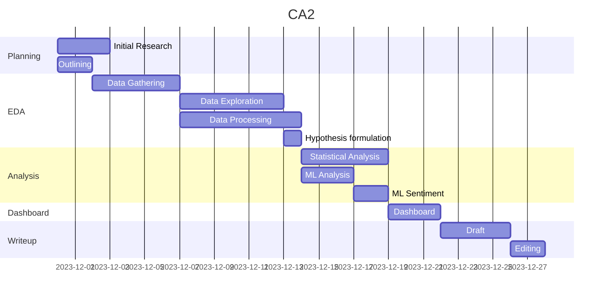

Due 3rd of January.

Don't overthink it.

## Brief
Transport sector analysis in Ireland + comparison with other countries

- forecasting
- sentiment analysis
- evidence based recommendations

### Programming

- Implement in Jupyter (**20**)
- Gather and process data stored in two different formats (20)
	- csv, api, json, xml, database etc.
- Documentation (**20**)
	- justify and explain code choices
- Testing (**20**)
	- Testing & optimisation strategy 
		- ensure code is doing what it's meant to (unit tests?)
		- ensure code is making good use of resources (multithreading / async?)
  - [ ] Clarify whether we're expected to use a testing harness
- Manipulation (**20**)
	- Compare 2 (+) libraries/techniques for  - processing & aggregating data 
		- (pandas vs numpy) 
		- (pandas vs SQL)
		- (Postgres vs Sqlite)
		- (requests vs async grequests)
		- 
  - [ ] Clarify whether using SQL / R would be a valid comparison
  - [ ] Can we do anything not in jupyter? Database? Test script?
### Statistics

- Descriptive statistics, visualisations -> justify chosen models (**30**)
- Inferential statistical analysis of variables in datasets (confidence intervals, etc.) (**25**)
- Compare countries to Ireland with parametric & non-parametric inferential stats (5 different) (**40**)
	- t test
	- anova
	- wilcoxon
	- chi squared
	- U test
	- ...
 - Tie statistical analysis to the rest of the project - challenges, where it lead to, etc. (**15**)

### Machine Learning
- Justify use of ML in transport analysis - prediction, classification, clustering, sentiment analysis, recommendation, time series analysis (at least 2 methods) (**30**)
	- select hyperparameters with GridSearchCV
	- choose appropriate features
- Collect dataset about transport and perform sentiment analysis for producers/consumers PoV in Ireland (**25**)
- [ ] Thoughts on how to do this without twitter? News APIs?
		- https://newsapi.org
	- `e847bba6b48a41b6955a4ecd86d5eac8`
	 - https://mediastack.com/sources/ireland-news-api
	  - https://docs.aylien.com/newsapi/v6/getting-started/#overview
- train/test splits, cross validation, appropriate metric choices -  validate modelling outcomes (**30**)
	- dimensionality reduction where appropriate
 - Graphics / table to compare ML modelling outcomes (**15**)

### Visualisation
- Discuss process of acquiring raw data (***15**)
	- positive / negative aspects of acquisition
	- Discuss relevance
	- Discuss licensing implications
- EDA (**25**)
	- Missing data
	- Inconsistences
	- Anomalies
	- Discuss raw data 
	- Appropriate visualisations
- Feature engineering (**30**)
	- Enrich data for use in ML
	- Rationalise decisions
	- Show how treatment has addressed issues identified in EDA
	- Discuss how engineered data will help with further analysis
- Interactive dashboard (**30**)
	- showcase information gathered following ML analysis
	- Follow Tufte's principals
	- Detail rationale for approace / visualisation choice
 - [ ] What tech do we use for this and do we have to host it on heroku etc - will a html widget within a notebook do?

- Documentation should have evidence of project planning (timelines)
- Additional resources allowed - scripts, images, data, etc.
- Raw and structured data should be submitted 
- Max 1 notebook per module
- 3000 +/- 10% word count

 __TODO:__ 
 - [x] Set up obsidian vault for CA2 and get md kanban board up and running ✅ 2023-12-02
 - [ ] Identify dates when I will commit to working on the CA
 - [ ] Identify project phases - initial research, data gathering, data exploration, analysis, presentation outcomes / deliverables, etc. 
	 - Estimate complexity
	 - Split into subtasks - tie directly to learning outcomes
	 - Fit into gantt chart based on above dates

---
### Data sources
https://data.london.gov.uk/dataset/number-bicycle-hires
https://github.com/yvetteyyuan/Santander-Cycles-User-Data-Analysis
https://data.gov.ie/dataset/dublinbikes-api
https://www.met.ie/climate/available-data/historical-data

12